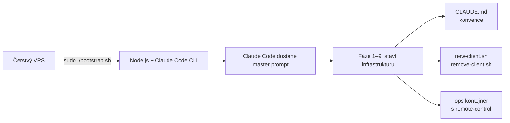
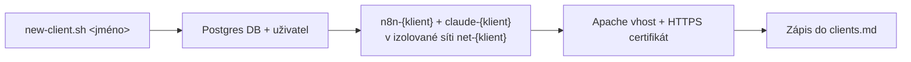
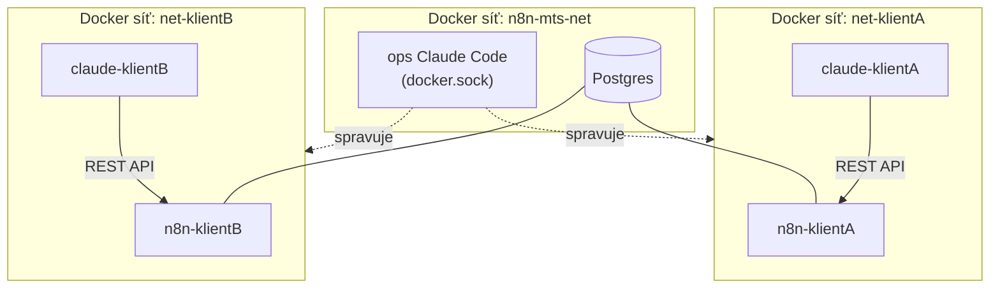

# n8n multi-tenant starter


[](LICENSE)

Startovací bod pro self-hosted multi-tenant n8n hosting na VPS, kde
architekturu (Apache, Postgres, Docker sítě, izolované klientské páry)
staví Claude Code na základě jednoho promptu.

Autor: **David Helcl**

## Obsah

- [Jak to funguje](#jak-to-funguje)
- [Architektura](#architektura)
- [Rychlý start](#rychlý-start)
- [Struktura repozitáře](#struktura-repozitáře)
- [Sledování spotřeby a paušál](#sledování-spotřeby-a-paušál)
- [Stav projektu](#stav-projektu)
- [Bezpečnostní poznámky](#bezpečnostní-poznámky)
- [Licence](#licence)

## Jak to funguje

Instalace má dvě odlišné fáze, které je dobré rozlišovat:

**1. Jednorázová instalace** — `bootstrap.sh` na čerstvém VPS nainstaluje
Claude Code a předá mu podrobný prompt (fáze 1–9). Claude Code podle
něj postaví celý server a mimo jiné vygeneruje `scripts/new-client.sh`,
`scripts/remove-client.sh` a konvence v `CLAUDE.md`. Tahle fáze proběhne
jen jednou, při prvním nasazení.



**2. Běžný provoz** — zakládání a rušení klientů dál neběží přes AI
prompt, ale přes vygenerovaný **bash skript** `new-client.sh`. Ten je
deterministický: stejné jméno klienta vždy vede na stejně
strukturovaný výsledek (jen konkrétní hodnoty — port, heslo, klíče —
jsou pokaždé jiné).



Skript jde spustit buď ručně (`./scripts/new-client.sh jmeno-klienta`),
nebo konverzačně — zprávou ops Claude Code asistentovi (třeba z mobilu):
*"Založ nového klienta 'firma-xyz'."* V tom případě je v hraní znovu
LLM, který zprávu interpretuje a podle konvencí v `CLAUDE.md` by měl
prostě spustit stejný skript — v naprosté většině případů tak i udělá,
ale na rozdíl od přímého spuštění skriptu to není matematicky
garantované.

## Architektura

Dvouvrstvý model:

- **Ops vrstva** (1× na server) — Claude Code s přístupem k `docker.sock`,
  spravuje celý server: zakládá/ruší klienty, upravuje Apache/Postgres.
  Nikdy nezasahuje přímo do dat konkrétního klienta.
- **Klientská vrstva** (1× pár na klienta) — `n8n-{klient}` +
  `claude-{klient}` ve vlastní izolované Docker síti `net-{klient}`.
  Klientský Claude Code mluví jen s n8n REST API svého souseda, nemá
  `docker.sock` ani přístup k jiným klientům.



Detailní diagram: [`docs/architektura.html`](docs/architektura.html)
(HTML soubor, otevírá se v prohlížeči). Krok za krokem psaný návod:
[`docs/navod.md`](docs/navod.md).

## Rychlý start

Na čerstvém VPS (Debian 12 nebo Ubuntu 24.04, min. 4 vCPU / 8 GB RAM),
přihlášený jako root:

```bash
git clone https://github.com/p33cz/n8n-multi-tenant-starter.git /opt/n8n-mts
cd /opt/n8n-mts
chmod +x bootstrap.sh
sudo ./bootstrap.sh
```

Skript se zeptá na doménu a Anthropic API token, ověří DNS a spustí
Claude Code, který podle vloženého promptu postaví zbytek sám. Detailní
požadavky a popis jednotlivých kroků: [`docs/navod.md`](docs/navod.md).

## Struktura repozitáře

```
bootstrap.sh            — spustí se na čerstvém VPS, nainstaluje Claude Code
                           a předá mu řízení k postavení celé infrastruktury
docs/navod.md            — psaný návod k celému postupu, krok za krokem
docs/architektura.html   — grafický diagram architektury
scripts/                 — sem Claude Code při instalaci vygeneruje
                           new-client.sh / remove-client.sh / usage-report.sh
```

`scripts/` je při prvním checkoutu prázdný — `new-client.sh`,
`remove-client.sh` a `usage-report.sh` nejsou psané ručně předem,
generuje je Claude Code sám během instalace (fáze 6 a 7 v `bootstrap.sh`)
podle stavu konkrétního serveru. Jakmile je vygeneruje, je vhodné je
commitnout do repa, aby byla verzovaná i tato část.

## Sledování spotřeby a paušál

Všichni `claude-{klient}` sdílejí jeden `ANTHROPIC_API_KEY`, takže
Anthropic fakturuje spotřebu jako celek, ne po klientech. Pokud klienti
platí paušál, který má náklady na AI pokrýt, je potřeba spotřebu
sledovat mimo Anthropic fakturaci — fáze 7 v `bootstrap.sh` proto
nechává Claude Code vygenerovat:

- `clients/{klient}/usage.log` — spotřeba tokenů daného klienta podle
  transkriptů jeho Claude Code relací
- `pricing.conf` — aktuální ceník modelů (per 1M tokenů), aby šel snadno
  aktualizovat
- `scripts/usage-report.sh` — přehled spotřeby a odhadované ceny per
  klient, s upozorněním, když se klient blíží limitu paušálu

Je to jen orientační odhad (na základě lokálních transkriptů, ne
oficiálního Anthropic vyúčtování) — pro přesná čísla použij Anthropic
Console.

## Stav projektu

Toto je startovací bod (bootstrap skript + prompt + diagram), ne
otestovaná produkční instalace. Po prvním běhu na reálném serveru
doporučeno:
- zkontrolovat vygenerované `CLAUDE.md`, `clients.md` a skripty ve
  `scripts/` a commitnout je
- projít bezpečnostní poznámky v [`docs/navod.md`](docs/navod.md)
- ověřit chování po `reboot` (automatický restart n8n/Postgres/ops
  kontejneru)

## Bezpečnostní poznámky

`docker.sock` smí mít mountnutý **jen** ops kontejner — to je jádro
izolace mezi klienty. Plné vysvětlení rizik a kompromisů:
[`docs/navod.md` → Bezpečnostní poznámka](docs/navod.md#bezpečnostní-poznámka).

## Licence

[MIT](LICENSE) — © 2026 David Helcl. Kód je možné svobodně používat,
upravovat i šířit dál, licence jen vyžaduje zachovat copyright notice.
